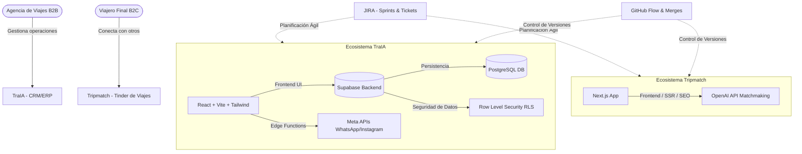

# 🎓 Exposición de Prácticas Duales: LD Quantum
### Grado Superior en Desarrollo de Aplicaciones Multiplataforma (DAM) — CPIFP Alan Turing (Málaga)

Este repositorio contiene la documentación, guiones y recursos correspondientes a la presentación del proyecto de prácticas duales de segundo año en **LD Quantum**, una startup tecnológica dedicada a la digitalización y revolución del sector turístico tradicional.

---

## 🎥 Vídeo de la Exposición (Vídeo Único)
De acuerdo con las directrices de la rúbrica, se ha unificado la exposición en un único vídeo que contiene tanto la **Parte Común (Presentación de la Empresa)** como las **Partes Individuales** de cada integrante.

* 🔴 **Vídeo Completo de la Exposición:** [Ver Exposición en YouTube (Parte Común + Individuales)](https://youtu.be/rBIQwdBLrjI)

### ⏱️ Marcas de Tiempo e Índice
Para facilitar la evaluación por parte del profesorado, a continuación se detallan los accesos directos con salto de tiempo directo en YouTube para cada sección:

* **[00:00 - 05:00] Parte Común (Empresa LD Quantum)** — Presentación conjunta de la startup y los proyectos.
  * [⏱️ 00:00 - 02:30](https://youtu.be/rBIQwdBLrjI?t=0): Introducción, TraIA y metodologías (Expone: Samuel García Ruiz)
  * [⏱️ 02:30 - 05:00](https://youtu.be/rBIQwdBLrjI?t=150): Gestión de código, Tripmatch y alineación curricular (Expone: Mario García Luque)
* **[⏱️ 05:00 - 10:00] Parte Individual — Samuel García Ruiz** — [Ver Sección en YouTube](https://youtu.be/rBIQwdBLrjI?t=300): Exposición de sus desarrollos (Supabase, Dashboard de Estadísticas, Email Marketing, Usabilidad de Cartelería y Bugs).
* **[⏱️ 10:00 - 15:00] Parte Individual — Mario García Luque** — [Ver Sección en YouTube](https://youtu.be/rBIQwdBLrjI?t=600): Exposición de sus desarrollos (Metodología Jira, Chatbots de IA en Tripmatch/TraIA, Gestión de Estado React para Portales de Reservas/Cliente).

---

## 👥 Datos de los Alumnos
* **Mario García Luque** — [GitHub Profile](https://github.com/Mariogarluu)
* **Samuel García Ruiz** — [GitHub Profile](https://github.com/sgarrui1201)
* **Centro Educativo:** CPIFP Alan Turing (PTA, Málaga)
* **Curso Académico:** 2025 / 2026 (2º DAM Mañana)

---

## 🛠️ Tecnologías Utilizadas

### Ecosistema TraIA (B2B CRM & ERP)

### Ecosistema Tripmatch (B2C Tinder de Viajes)

### Herramientas de Metodología y Desarrollo

---

## 📂 Visión General del Proyecto

Durante nuestra estancia 100% presencial en **LD Quantum**, participamos activamente en un entorno de desarrollo profesional colaborando en el diseño y despliegue de dos grandes ecosistemas de software paralelos:

### 1. TraIA (Business-to-Business - B2B)
Es el producto estrella de la compañía. Se trata de un **CRM y ERP integral** adaptado a agencias de viaje tradicionales. Permite:
* Centralizar toda la facturación, presupuestos y fichas de clientes.
* Generar itinerarios de viaje automatizados potenciados con Inteligencia Artificial.
* Comunicarse con clientes integrando las APIs oficiales de Meta (WhatsApp, Instagram, etc.) mediante **Edge Functions** de Supabase.

### 2. Tripmatch (Business-to-Consumer - B2C)
Nacido de la necesidad de dar un espacio propio al viajero final. Es una plataforma con un concepto tipo **"Tinder de viajes"** para conectar viajeros con destinos o afinidades compartidas.
* Desarrollado con total autonomía técnica y creativa por Samuel y Mario.
* Utiliza el framework **Next.js** para maximizar el posicionamiento en buscadores (SEO) y Server-Side Rendering (SSR).
* Implementa la API de **OpenAI** para procesar mediante lenguaje natural y afinar la compatibilidad entre perfiles.

---

## 👥 Contribuciones Individuales

A continuación se detallan las responsabilidades e hitos técnicos logrados de manera individual por cada miembro del equipo de desarrollo.

### 💻 Mario García Luque (Ponente B)
* **Gestión de Metodologías Ágiles (JIRA):** Implantación de la herramienta JIRA en la empresa, configurando el tablero Kanban, sprints, priorización de tareas y reporte de incidencias.
* **Integración de IA en el Workflow:** Introducción de herramientas como Cursor IDE y Gemini para acelerar el desarrollo del equipo.
* **Chatbots Inteligentes:** Desarrollo del chatbot de **Tripmatch** (vía OpenAI API) para sugerir matches y planificar itinerarios, así como el chatbot interno de **TraIA** para soporte y navegación del CRM.
* **Gestión de Estado en Frontend (React):** Diseño e implementación del **Portal de Reservas** y **Portal del Cliente** en TraIA, manejando estados dinámicos avanzados (Contextos y hooks personalizados) para actualizar las reservas en tiempo real de forma no bloqueante y evitar parpadeos visuales (reduciendo peticiones redundantes).
* **Mantenimiento y Estabilidad:** Refactorización de código TypeScript, optimización de rendimiento en vistas complejas y control de pases a producción.

### 💻 Samuel García Ruiz (Ponente A)
* **Persistencia y Backend (Supabase/PostgreSQL):** Diseño del modelo relacional, modificación del esquema de base de datos en PostgreSQL, creación de relaciones complejas y configuración de políticas de seguridad a nivel de fila (**RLS - Row Level Security**) para proteger los datos corporativos.
* **Dashboard y Estadísticas (TraIA):** Desarrollo visual de la interfaz del panel de métricas con gráficos interactivos dinámicos y optimización de consultas masivas a Supabase mediante carga no bloqueante.
* **Módulo de Comunicación y Marketing:** Maquetación responsive de plantillas para Email Marketing y optimización de la usabilidad del constructor de cartelería y folletos (integración de emojis nativos, e historial de edición deshacer/rehacer).
* **Desarrollo en Tripmatch & Bugs:** Diseño UI inicial de la aplicación Next.js y resolución de inconsistencias visuales (capas z-index en menús flotantes, validaciones de formularios y control de navegación interna).

---

## 📅 Temporalización Semanal de Tareas

A continuación se detalla la planificación temporal de las 17 semanas de estancia (desde el 21 de enero al 28 de mayo) en la empresa LD Quantum:

| Semana | Actividad / Tareas de Mario García Luque | Actividad / Tareas de Samuel García Ruiz |
| :---: | :--- | :--- |
| **Semanas 1-2** | Integración en la oficina presencial. Instalación y configuración de JIRA (tableros Kanban, flujos de trabajo, sprints iniciales). | Configuración del entorno local de desarrollo (React + Vite + Tailwind). Análisis del modelo de datos inicial de TraIA. |
| **Semanas 3-4** | Definición del flujo de control de versiones Git/GitHub. Diseño de la estructura del Portal del Viajero en TraIA. | Análisis y diseño del modelo relacional de base de datos ampliado en PostgreSQL. |
| **Semanas 5-6** | Integración con la API de OpenAI y desarrollo inicial de la lógica de conversación del Chatbot de Tripmatch. | Creación de nuevas tablas en Supabase y configuración de las políticas RLS (Row Level Security) iniciales. |
| **Semanas 7-8** | Desarrollo de las interfaces principales del Portal de Reservas en TraIA (vistas individual y grupal). | Rediseño visual de la interfaz del panel de estadísticas y definición del sistema de gráficos de TraIA. |
| **Semanas 9-10** | Optimización de la reactividad del Portal del Cliente con Contextos de React y Custom Hooks para evitar parpadeos visuales. | Implementación y optimización de la carga asíncrona no bloqueante de registros históricos de campañas en Supabase. |
| **Semanas 11-12** | Desarrollo del Chatbot de asistencia del CRM TraIA para soporte al agente de viajes en la navegación del ERP. | Desarrollo del constructor visual de folletos en el módulo de Cartelería de TraIA. |
| **Semanas 13-14** | Inicio del desarrollo del proyecto Tripmatch (B2C) en Next.js, implementando arquitectura orientada a SEO y SSR. | Implementación de funcionalidad deshacer/rehacer y soporte de emojis en el constructor. Diseño de plantillas de Email Marketing. |
| **Semanas 15-16** | Pruebas de integración del recomendador de afinidad por IA en Tripmatch. Tipado fuerte de TypeScript en llamadas API. | Solución de bugs visuales de CSS (superposición de z-index en menús) y validación de entrada de datos en registro de usuarios. |
| **Semana 17** | Pruebas finales de rendimiento, optimizaciones de velocidad y despliegue definitivo de los entornos de producción. | Verificación integral de las políticas RLS en base de datos y validaciones de seguridad previas al cierre de la estancia. |

---

## 📈 Metodología y Control de Versiones

Trabajando en la misma oficina presencial junto a otros compañeros, el control de versiones fue fundamental para asegurar la integración continua del código.
* **Metodología Ágil:** Sprints semanales con seguimiento diario en Jira.
* **GitHub Flow:** Cada desarrollador trabajaba en una rama propia (ej. `Samuel` o `Mario`).
* **Integración Continua:** Realización de merges diarios hacia la rama de desarrollo (`Develop`), lo que obligó a una constante resolución de conflictos complejos y fomento de buenas prácticas de programación colaborativa.

---

## 🏫 Alineación con el Currículo DAM (Conocimientos Adquiridos)

El desarrollo de estos proyectos permitió poner en práctica directa las competencias clave de varios módulos académicos del ciclo:
* **Desarrollo de Interfaces (DI):** Construcción de interfaces interactivas complejas, optimización UX/UI y adaptabilidad en pantallas para CRM/ERP (React) y Next.js.
* **Acceso a Datos (AD):** Consultas avanzadas a PostgreSQL, optimización de peticiones asíncronas de datos masivos y seguridad RLS con Supabase.
* **Entornos de Desarrollo (ED):** Control de flujo de ramas de Git, resolución de conflictos cotidianos en equipo y gestión de proyectos con metodologías ágiles Jira.
* **Sistemas de Gestión Empresarial (SGE):** Arquitectura y módulos funcionales de un sistema CRM/ERP real para empresas turísticas (TraIA).
* **Programación de Servicios y Procesos (PSP):** Consumo de APIs RESTful de terceros (OpenAI API, Meta APIs) y desarrollo de Edge Functions.

---

## 🌟 Valoración de la Experiencia Dual

### Mario García Luque
> "Mi experiencia en LD Quantum ha sido sumamente enriquecedora. Trabajar en un entorno de oficina 100% presencial junto a otros desarrolladores me ha enseñado a coordinar esfuerzos de manera ágil. Instaurar la metodología Scrum con JIRA y optimizar nuestro flujo con herramientas de IA (como Gemini y Cursor) ha cambiado por completo mi forma de abordar el desarrollo de software. Además, el reto de gestionar estados complejos en el frontend de TraIA y diseñar sistemas conversacionales con OpenAI me ha dado una base sólida para afrontar el mercado laboral como desarrollador Fullstack."

### Samuel García Ruiz
> "Estas prácticas duales me han brindado la oportunidad de trabajar con tecnologías modernas en proyectos de escala real. Encargarme del diseño de base de datos y la seguridad con Supabase RLS me ha aportado un conocimiento profundo sobre acceso a datos y seguridad. Además, desarrollar componentes avanzados en TraIA y tener la autonomía de idear y construir Tripmatch desde cero ha potenciado mi capacidad de resolución de problemas. La colaboración mediante Git y la resolución diaria de conflictos de código ha sido un aprendizaje fundamental que no se puede replicar fácilmente en el aula."

---

## 🎥 Índice de la Presentación de Prácticas

La defensa académica del proyecto está dividida en las siguientes piezas audiovisuales y guiones:

### 1. Presentación Conjunta de Proyecto (Duración: 5:00 min)
* **0:00 - 2:30 — Samuel García Ruiz (Parte 1)**
  * Introducción al equipo, estancia dual presencial en LD Quantum.
  * Presentación de **TraIA** (CRM/ERP), objetivos de digitalización turística y Stack Tecnológico (React, Vite, Tailwind CSS, Supabase, Meta API integration).
  * Metodología de gestión de proyectos mediante Jira.
* **2:30 - 5:00 — Mario García Luque (Parte 2)**
  * Control de versiones diario en GitHub, merges y resolución de conflictos.
  * Transición a **Tripmatch** (B2C), autonomía en el diseño y arquitectura del proyecto.
  * Stack técnico de Tripmatch (Next.js, OpenAI API) e integración con los módulos del grado superior.

### 2. Vídeo de Contribución Individual — Samuel García Ruiz (Duración: 5:00 min)
* **0:00 - 1:00 — Introducción y Backend:** Jira, ramas GitHub y Supabase (Esquemas PostgreSQL y políticas RLS).
* **1:00 - 2:15 — Panel de Estadísticas:** Dashboard interactivo en TraIA y optimización de carga de datos masivos.
* **2:15 - 3:30 — Email Marketing y Cartelería:** Plantillas responsive y refinamiento de controles del editor (historial deshacer/rehacer y emojis).
* **3:30 - 4:30 — Tripmatch y Resolución de Bugs:** Solución de bugs visuales (z-index, menús interactivos, validaciones de registro).
* **4:30 - 5:00 — Conclusiones:** Evolución personal y cierre.

### 3. Vídeo de Contribución Individual — Mario García Luque (Duración: 5:00 min)
* **Estructura de defensa:**
  * **Introducción y Agile:** Implementación de Jira y cultura ágil del equipo de desarrollo, uso de Cursor IDE y asistentes IA en el día a día.
  * **Chatbots e IA Conversacional:** Lógica e integración con la API de OpenAI para el recomendador de Tripmatch y el asistente del ERP TraIA.
  * **Portal del Cliente/Viajero:** Desarrollo de React Hooks y Contextos para la visualización del estado de las reservas.
  * **Optimización y Estabilidad:** Tipado fuerte con TypeScript y correcciones finales para despliegue en producción.
  * **Cierre y Lecciones Aprendidas:** Gestión del ciclo de vida del software en proyectos reales.
